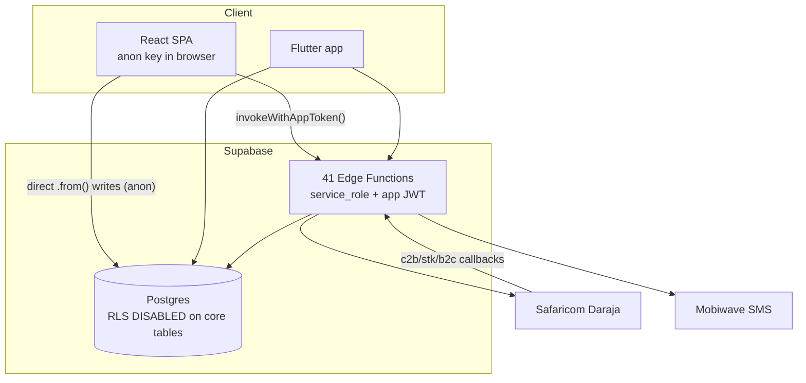
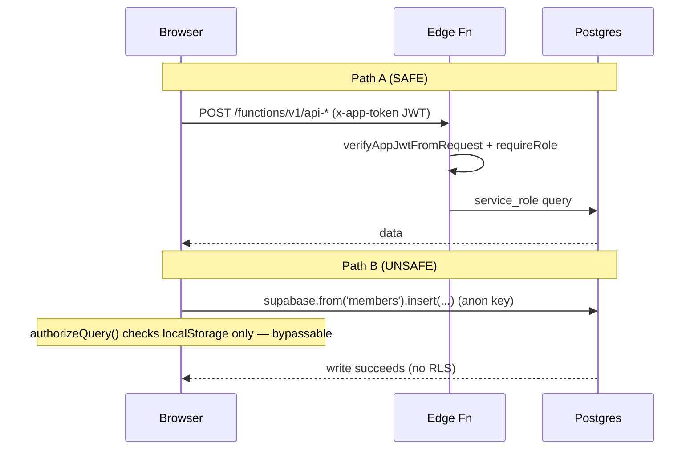
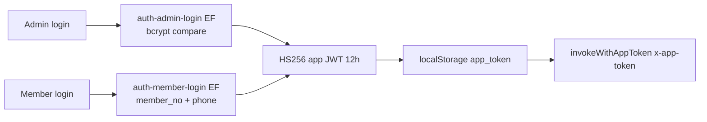

# Malanga Welfare — Full Technical Audit

Auditor role: Principal Architect / Staff Eng / Security / DevOps / PM
Date: 2026-07-26 · Branch: main @ bd5204c · Version tag: v3.1.4
Scope: React SPA (`src/`) + Supabase (Postgres, 41 Edge Functions, 112 migrations) + Flutter app (`flt_app/`) + M-Pesa/SMS integrations.

--------------------------------------------------------------------
## 0. TL;DR — Read This First

This is a **functionally rich, genuinely useful welfare-society management
system** with a deep, hard-won financial domain model (wallet ledger, case
waterfall, discipline/probation automation). It is run in production
(malangawelfare.org / mwelfare.netlify.app) and clearly serves a real society.

It is **NOT safe at its current security posture** and must not be scaled to
"millions of users" until the data-access model is fixed. Three findings are
existential:

1. **M-Pesa `consumer_secret` and `passkey` are compiled into the public JS
   bundle** (confirmed present in `deploy.zip/assets/Settings-*.js`), and
   `netlify.toml` deliberately whitelists them out of secret scanning.
2. **Row Level Security is DISABLED on every core table** (members, accounts,
   settings, transactions, cases, dependants, residences) and the browser holds
   the anon key and writes directly to the DB. The only "authorization" for
   those direct writes is **client-side localStorage** the user fully controls.
3. **Build artifacts are committed to git** (`deploy.zip`, `dist.zip`, `mlg.zip`,
   `dist/`), and `.env` was committed earlier in history. There is a remote
   branch literally named `agent-to-exposed-secrets-in-build-*`.

Overall project score: **48/100.** Strong product & domain logic dragged down
by a broken trust boundary. Everything else is fixable; #1 and #2 are the job.

--------------------------------------------------------------------
## PHASE 1 — Project Discovery

### Stack
| Layer | Tech |
|---|---|
| Frontend | React 18.3, TypeScript 5.5, Vite 7.3, SWC |
| UI | shadcn-ui (Radix), Tailwind 3.4, lucide-react |
| Data/state | TanStack React Query 5, React Hook Form + Zod 3 |
| Backend | Supabase: Postgres, Edge Functions (Deno), no Supabase Auth (custom) |
| Mobile | Flutter (`flt_app/`), Supabase Dart client |
| Payments | M-Pesa Daraja (STK, C2B, B2C, reversal) |
| SMS | Mobiwave (README) / "TextSMS Kenya" (QWEN.md) — inconsistent docs |
| Reports | jsPDF + autotable, xlsx, recharts, html2canvas |
| Auth crypto | bcryptjs (admin pw), jose HS256 (app JWT) |
| Package mgr | bun (lockfile `bun.lockb`) + npm lockfile both present |
| Hosting/CI | Netlify + GitHub Actions (`.github/workflows/deploy.yml`) |

### Config / env
- `.env`, `.env.example`, `supabase/.env`, `flt_app/.env.example`.
- `.gitignore` DOES ignore `.env*` now — but `.env` is in git history
  (commits 35df62b, cefced8, 5ae2546). **Treat all those secrets as burned.**
- `supabase/.env` holds `SUPABASE_SERVICE_ROLE_KEY`, `MLG_INTERNAL_BULK_KEY`,
  `SUPABASE_ACCESS_TOKEN` — locally present, must never be bundled/committed.

### Third-party services
Supabase (DB/functions), Safaricom Daraja, Mobiwave SMS, Netlify, Builder.io
(`VITE_PUBLIC_BUILDER_KEY`), Lovable (origin scaffold, `lovable-tagger`).

### Missing infra
No caching layer (Redis referenced in vite serverOnly list but unused), no
centralized logging/monitoring/APM, no error tracking (Sentry), no analytics,
no feature flags, no Docker/K8s/IaC.

--------------------------------------------------------------------
## PHASE 2 — Architecture

### System architecture

The defining architectural flaw is the **two parallel data paths**: a secure one
(Edge Functions with app JWT verification + service role) and an insecure one
(browser → Postgres directly on the anon key). The secure path is well built;
the insecure path undermines it entirely.

### Request flow (two paths)

### Auth flow

Note: member auth = member number + **phone number as the sole secret**. Phone
numbers are low-entropy and often known; this is weak (see Phase 5).

--------------------------------------------------------------------
## PHASE 3 — Business Logic

Core domains: Members (probation 90d → active → inactive → deceased),
Contributions/Wallet, Welfare Cases (education/sickness/death), Penalties &
Arrears, Suspense (wrong M-Pesa), Discipline automation, Reporting, SMS.

### Wallet ledger (single source of truth)
`calculate_wallet_balance()` derives balance from transactions; migration
`20260423120000_wallet_ledger_single_source_of_truth` + `20260427163500_enforce
_wallet_balance_ledger_derived` make `members.wallet_balance` ledger-derived.
Good design — balance is computed, not mutated ad hoc.

### Payment waterfall (`apply_wallet_payment_waterfall`)
Oldest unpaid cases first (finalized/missed before active), reinstatement
penalty last, only for inactive members in an "open cycle." Discipline sweep
flips members inactive at 2+ unpaid cases / default streak ≥2. Recursion between
sweep↔waterfall is broken via a `SET LOCAL app.auto_wallet_reactivation` flag
and statement-level trigger.

**Assessment:** the logic is sophisticated and clearly battle-tested — but the
**112 migrations, ~40 of them consecutive "fix_/heal_/collapse_cascade/fix_
stale_92day" patches over ~2 weeks (Jul 2026)**, are a loud signal that this
waterfall/discipline engine went through repeated production incidents. It works
now but is fragile and under-tested (no pgTAP/unit coverage of these functions).

### Hidden assumptions / potential bugs
- Penalty amount hardcoded twice: `v_penalty_required := 300` in the function vs
  `'penalty'` config elsewhere — magic number, drift risk.
- Member match in login iterates candidate formats; a member with number "07..."
  could collide with normalized forms — worth a uniqueness/format audit.
- Statement-level discipline trigger runs a **full-table sweep on every
  transaction insert** — O(members) per write. A scaling landmine (Phase 12).

--------------------------------------------------------------------
## PHASE 4 — Code Quality

| Dimension | Score /10 | Note |
|---|---|---|
| Readability | 7 | Clear naming, good comments in EFs & migrations |
| Maintainability | 5 | 112 migrations, dup SQL, artifacts in repo |
| Type safety | 4 | `strict:false`, `noImplicitAny:false`, `strictNullChecks:false`; `any` casts (`member as any`) |
| Modularity | 6 | Good `_shared/`, dataService layer; but two data paths |
| DRY | 5 | CORS/normalizePhone/role sets duplicated across EFs |
| Error handling | 6 | EFs consistent; client swallows some errors to console |
| Testing | 3 | 3 Playwright e2e specs only; no unit/integration/DB tests |
| Documentation | 7 | QWEN.md is excellent; README stale/contradictory |

Dead/duplicate code & smells:
- Root clutter: `deploy.zip`, `dist.zip`, `mlg.zip`, `dist/`, `-p/` dir,
  `vite.config.ts.timestamp-*.mjs`, `graphify-out/` committed.
- Duplicate migration pair `20231217000000/…001_create_transfer_function`.
- Two SMS provider names in docs (Mobiwave vs TextSMS).
- `src/integrations/mpesa/client.ts` uses `Buffer` (Node) in a browser module —
  won't run in-browser; appears vestigial (real M-Pesa is server-side/PHP+EFs).

--------------------------------------------------------------------
## PHASE 5 — Security Audit

| # | Finding | Severity |
|---|---|---|
| S1 | M-Pesa `consumer_secret` + `passkey` compiled into public bundle (confirmed in deploy.zip Settings chunk); `netlify.toml` whitelists them from secret scan | **CRITICAL** |
| S2 | RLS disabled on all core tables + browser writes via anon key; authz is client-side localStorage (`getCurrentUser` reads/parses localStorage, trivially forged) | **CRITICAL** |
| S3 | Build artifacts (zip/dist) and historical `.env` committed to git → secret exposure & supply-chain | **CRITICAL** |
| S4 | Member auth uses phone number as sole credential (low entropy, enumerable via unprotected members table) | **HIGH** |
| S5 | Edge Function CORS = `Access-Control-Allow-Origin: *` on privileged endpoints | **HIGH** |
| S6 | No rate limiting enforced on login/STK EFs (a rate-limit migration exists but not wired into hot paths) | **HIGH** |
| S7 | Legacy plaintext admin password fallback still in `auth-admin-login` (`password === storedPassword`) | **MEDIUM** |
| S8 | App JWT is HS256 with a single shared `APP_JWT_SECRET`; no rotation, `atob` client decode without verification for expiry only | **MEDIUM** |
| S9 | M-Pesa B2C `SecurityCredential` used unencrypted (code comment "Should be encrypted") | **MEDIUM** |
| S10 | No webhook signature/allowlist validation shown on c2b/stk callbacks (spoofable payment events) | **HIGH** — verify |

**S1+S2+S3 together mean:** anyone who loads the site gets the anon key, and can
read/write members, transactions, accounts, cases directly against Postgres,
because RLS is off and the "guard" runs in their own browser. The M-Pesa
merchant credentials in the bundle allow initiating STK/queries as the society.
This is a full data-integrity and financial-fraud exposure. OWASP: A01 (Broken
Access Control), A02 (Crypto Failures/secret exposure), A05 (Misconfig).

--------------------------------------------------------------------
## PHASE 6 — Database

- **Schema:** mature — members, users, cases, transactions, accounts,
  residences, dependants, audit_logs, settings, wrong_mpesa_transactions,
  notifications, sms_templates, member_status_transitions, member_default_streaks.
- **Ledger-derived balances** (good). SECURITY DEFINER RPCs for privileged ops.
- **Indexes:** trigram search, numeric member-number sort, performance indexes
  migrations present — reasonable.
- **Migrations:** 112, many corrective; needs squash/consolidation into a clean
  baseline before scaling. Keep the history archived, ship a fresh `schema.sql`.
- **Missing:** documented backup/PITR strategy, no transactional isolation notes
  on the waterfall (uses FOR UPDATE — good), no partitioning plan for
  transactions (will be the hot table).
- **Risk:** statement-level trigger doing full-member sweeps (N+1-at-scale).

--------------------------------------------------------------------
## PHASE 7 — APIs (Edge Functions, 41)

All follow a consistent shape: CORS preflight → `verifyAppJwtFromRequest` →
`requireXRole` → service_role query → JSON. This is the good half of the system.
Representative: `api-stk-push`, `api-collect-fee`, `api-case-bulk-deduct`,
`api-members-list`, `api-trigger-waterfall`, `api-reinstatement-execute`,
`auth-admin-login`, `auth-member-login`, `c2b-webhook`, `mpesa-callback`.

Gaps: no versioning, no pagination contract standardization, `*` CORS,
inconsistent rate limiting, no OpenAPI/schema docs, no request-schema validation
library (manual `if (!x)` checks).

--------------------------------------------------------------------
## PHASE 8 — Frontend

Solid shadcn/Radix component system, responsive helpers, ErrorBoundary,
React Query provider, route guards (`ProtectedRoute`, `MemberProtectedRoute`).
Weaknesses: guards are decorative (real trust is server-side, which for Path B
doesn't exist); light-only design (matches user preference); a11y/SEO not
audited; heavy libs chunked well in `vite.config`. Loading/error states present.

--------------------------------------------------------------------
## PHASE 9 — Backend / PHASE 10 — DevOps

- Backend logic split between Edge Functions and Postgres functions/triggers —
  a lot of business logic lives in SQL (powerful but hard to test/observe).
- DevOps: GitHub Actions builds with `npm ci` then Netlify deploy — but repo is
  bun-primary (lockfile mismatch → nondeterministic installs). No tests in CI.
  No staging env, no blue/green/canary, no IaC, no monitoring/alerting/backups
  documented. `deploy-functions.bat` is manual, Windows-only.

--------------------------------------------------------------------
## PHASE 11 — AI

No AI/LLM/embeddings/RAG in the product. (Tooling like graphify/QWEN.md is dev
scaffolding.) Opportunities in Phase 14.

--------------------------------------------------------------------
## PHASE 12 — Performance

- Statement-level discipline sweep on every `transactions` insert → full member
  scan per write. **#1 scaling bottleneck.** Convert to row-level + targeted, or
  move to a queued/cron sweep.
- `calculate_wallet_balance` recomputed repeatedly inside waterfall loops.
- Client bundle: chunked reasonably; recharts/xlsx/jspdf are heavy — lazy-load.
- transactions table will need partitioning + covering indexes at scale.

--------------------------------------------------------------------
## PHASE 13 — Technical Debt (prioritized)

HIGH: S1/S2/S3 (secrets + RLS + artifacts); no tests around financial engine;
migration sprawl; lockfile/CI mismatch.
MEDIUM: legacy plaintext pw fallback; `*` CORS; hardcoded penalty 300; dead
mpesa/client.ts; discipline sweep perf.
LOW: README/doc contradictions; committed `graphify-out`, `-p/` dir; TS non-strict.

--------------------------------------------------------------------
## PHASE 14 — Missing Features / Roadmap ideas

Member self-service PIN (replace phone-as-password), STK "pay now" in member
portal, receipts via SMS/PDF, arrears reminders automation, dashboards for
treasurer KPIs, export scheduling, multi-society (tenanting) for SaaS,
observability (Sentry), AI: anomaly detection on suspense/fraud, NL report
queries, auto-reconciliation of C2B against expected contributions.

--------------------------------------------------------------------
## PHASE 15 — Docs to generate
README (rewrite, fix contradictions), ARCHITECTURE, API (OpenAPI of 41 EFs),
DATABASE (from squashed baseline), SECURITY, DEPLOYMENT, OPERATIONS (runbooks
for waterfall/discipline incidents), CONTRIBUTING, ROADMAP, CHANGELOG.

--------------------------------------------------------------------
## PHASE 16 — Refactoring Plan
Quick wins: remove zips/dist/graphify from git + `git filter-repo` history purge;
rotate ALL secrets; move M-Pesa creds server-only; delete plaintext pw fallback.
Medium: route ALL writes through Edge Functions; re-enable RLS as defense-in-depth
(policies keyed to app JWT via `request.jwt` or a SECURITY DEFINER gateway);
lock CORS to allowlist; add rate limiting.
Major: squash migrations to a baseline; add pgTAP tests for waterfall/discipline;
CI with tests + bun; observability.

--------------------------------------------------------------------
## PHASE 17 — Testing
Current: 3 Playwright specs (members, registration-fee, timings). No unit,
integration, or DB-function tests. The financial engine — the riskiest code — is
entirely untested. This is the single biggest engineering gap after security.

--------------------------------------------------------------------
## PHASE 18 — Final Report

### Strengths
Real product solving a real problem; deep, ledger-correct financial domain;
clean Edge Function pattern; good component system; excellent QWEN.md context.

### Weaknesses / Risks
Broken trust boundary (anon-key writes + RLS off), secrets in bundle & git,
near-zero automated testing of money logic, migration sprawl, no observability.

### Scores
| Area | Score /100 |
|---|---|
| Security | 22 |
| Scalability | 45 |
| Code Quality | 58 |
| Maintainability | 50 |
| Performance | 55 |
| Architecture | 52 |
| Technical Debt | 40 |
| **Overall** | **48** |

--------------------------------------------------------------------
## Prioritized Action Plan

### Next 24 Hours (STOP THE BLEED) — effort S, impact CRITICAL
1. Rotate M-Pesa consumer key/secret/passkey, SMS token, Supabase service role,
   APP_JWT_SECRET. Assume all committed/bundled secrets are compromised.
2. Remove M-Pesa secret VITE_ vars from client; strip from `netlify.toml`
   whitelist; ensure only server-side EFs hold them. Rebuild & redeploy.
3. `git rm` deploy.zip/dist.zip/mlg.zip/dist/ ; add to .gitignore.

### Next Week — effort M, impact CRITICAL/HIGH
4. Purge secrets from git history (`git filter-repo`), force-push, rotate again.
5. Move ALL browser `.from().insert/update/delete` (and sensitive reads) behind
   Edge Functions with role checks. Audit the 30 direct `.from()` sites.
6. Re-enable RLS on core tables as defense-in-depth; lock EF CORS to allowlist;
   remove plaintext admin-password fallback.

### Next Month — effort M/L, impact HIGH
7. Add rate limiting to login/STK/webhook EFs; validate webhook authenticity.
8. Replace member phone-as-password with a PIN (a PIN-auth migration already exists).
9. pgTAP tests for waterfall + discipline; wire tests into CI; fix bun/npm lockfile.
10. Add Sentry + structured logging + uptime/alerting; document backup/PITR.

### Next Quarter — effort L, impact MEDIUM/HIGH
11. Squash 112 migrations into a clean baseline + schema.sql; write DB docs.
12. Fix discipline-sweep perf (row-level/queued); plan transactions partitioning.
13. Generate OpenAPI for the 41 EFs; version the API.

### Next 12 Months — effort L, impact strategic
14. Multi-tenant SaaS (serve many societies); observability dashboards;
    AI-assisted fraud/anomaly detection on suspense & C2B reconciliation;
    member self-service payments & automated reminders.

Recommended order = as numbered. Do 1–3 today; nothing else matters until the
secret exposure and anon-key write path are closed.
